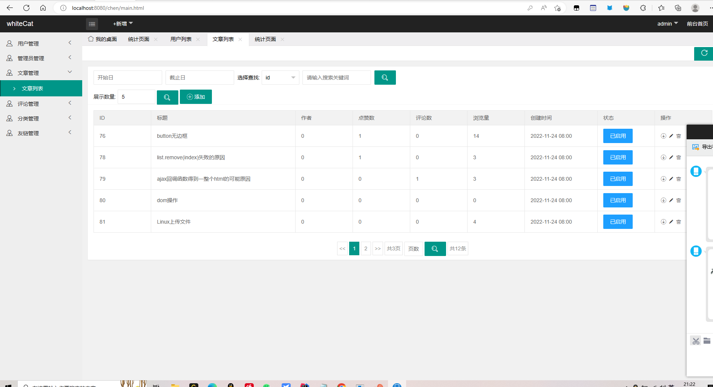

# whiteCat 访问地址  http://134.175.55.216:8082/huangyongtao/   

 **有问题可以发我邮箱862315743@qq.com** 

whiteCat博客/论坛介绍

springboot+mybatis+thymeleaf+layui实现，前端页面参考了https://gitee.com/NarraT0r/layui_Blog

这是我的一个web的课程设计的项目
实现了基本功能：

- 这里是列表文本文章：发文章，删文章，文章的标签，文章的点赞，评论，以及点赞数，评论数，浏览量的统计，文章的搜索，以及文章的封面设置
- 这里是列表文本评论：评论的楼层叠加，评论的点赞以及删除，评论敏感词过滤。
- 这里是列表文本用户空间：设置功能：修改个人信息，头像的修改，绑定邮箱以及邮箱验证码的发送，他人以及自己的空间。
- 这里是列表文本消息系统：消息的通知，目前只实现了点赞信息提醒以及私信功能，其他的消息通知大同小异就没做了。 
- 这里是列表文本其他功能：关注列表以及粉丝列表，前缀树实现的搜索提示跟敏感词过滤。

管理员：用户名admin 密码123456 这个账号的权限仅仅只能查看后台数据，并不能修改和删除，但是功能是完整实现了的，之前没做权限数据被人删了，就限制只能权限更高的账号才能修改数据了。 

登录/注册页面

首页

文章详细页

评论页

个人主页 + 粉丝列表+ 关注列表 + 消息页

他人主页

文章分类页

发帖页

用户搜索页

设置页

管理员页面

#### 使用说明

需导入在文件夹中的sql文件，本地访问为：http://localhost:8080/chen

2.  配置头像以及封面存放地址

3.  配置数据库

